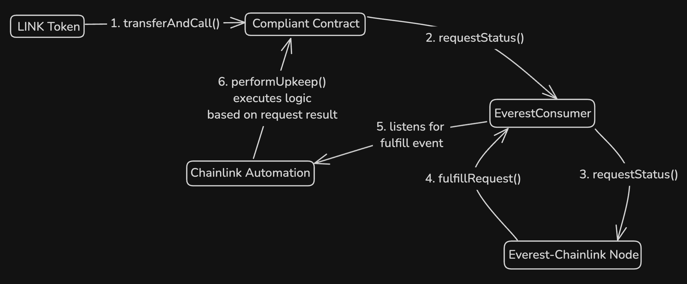

# Compliant Smart Contract

This project demonstrates a compliant smart contract. The `Compliant` contract can be interacted with to request the KYC status of an address and automatically execute logic based on the result.

## Table of Contents

- [Compliant Smart Contract](#compliant-smart-contract)
  - [Table of Contents](#table-of-contents)
  - [Overview](#overview)
  - [How does the compliance work?](#how-does-the-compliance-work)
  - [User Flow](#user-flow)
  - [Compliant Restricted Functionality](#compliant-restricted-functionality)
  - [Fees](#fees)
    - [Compliant Fee](#compliant-fee)
    - [Everest Fee](#everest-fee)
    - [Automation Fee](#automation-fee)
  - [Testing](#testing)
  - [Formal Verification](#formal-verification)
  - [Deployment](#deployment)
  - [Additional Comments](#additional-comments)
  - [Archives](#archives)

## Overview

Contract level compliance removes the risk of non-compliance at the lowest level of agreement execution, enabling regulated activity to be available on public chains.

## How does the compliance work?

Requests for the KYC status of an address are made through the [Chainlink](https://docs.chain.link/) network to [Everest](https://developer.everest.org/#chainlink-access-to-everest-oracle), a regulated provider of private and sybil resistant user data.

The request is for whether the address being queried has been sybil resistantly linked to someone who has completed KYC with the regulated entity or not.

Compliant restricted logic can only be executed on behalf of users who meet this criteria.

## User Flow

Users can interact with the `Compliant` contract to request the KYC status of an address in two ways:

1. Call `LINK.transferAndCall()` on the LINK token address, passing the Compliant contract's address, fee amount, and calldata. The calldata should include the address to query, instructions on whether to automate a response to the fulfilled compliance check request, and arbitrary data to pass to compliant restricted logic if automated execution is enabled and user is compliant. The fee amount to pass can be read from either `Compliant.getFee()` or `Compliant.getFeeWithAutomation()` depending on if the request is intended to use Automation or not.



2. Call `LINK.approve()` on the LINK token address, passing the Compliant contract's address and fee amount. Then call `Compliant.requestKycStatus()`, passing the address to query and instructions on whether to automate a response to the fulfilled compliance check request, and arbitrary data to pass to compliant restricted logic if automated execution is enabled and user is compliant.

## Compliant Restricted Functionality

The `Compliant` contract contains two practical examples of how a KYC status request can be integrated to restrict functionality to only compliant users.

1. The KYC status of a user can be requested.

   1b. The last fulfilled KYC status request can be read from Everest. This value can then be used to determine if a user can interact with a function (`doSomething()`). This functionality could also be used without having first made a request, relying on the latest fulfilled request somebody else has made about an address.

2. Or a KYC status request can be made, with contract functionality immediately executed by Chainlink Log Trigger Automation based on the result.

## Fees

A fee in LINK is taken for each request, covering the following:

- `Compliant` contract fee
- Everest fee
- Chainlink Automation fee (if applicable)

### Compliant Fee

This fee is intended as payment for the Owner of the `Compliant` contract. Chainlink Price Feed is used to get the USD value of LINK and calculate how much the `Compliant` contract should receive. Currently it is set to 50c per request, but a lower value or even a configurable value would be more attractive. These accumulated `Compliant` fees could then be periodically distributed amongst holders of a potential `Compliant` native token using Chainlink Automation.

### Everest Fee

This fee is required to pay for requests made to Everest's Chainlink node.

### Automation Fee

This fee is only charged if the request specifies the use of Automation following the requests fulfillment. This value is whatever the minimum balance required to maintain the associated Chainlink Automation Upkeep is.

## Testing

See coverage with `forge coverage` and `forge coverage --report debug`.

The `cannotExecute` modifier on `checkLog()` will have to be commented out for some of the tests in `CheckLog.t.sol` to pass. This will also require the `test_compliant_checkLog_revertsWhen_called` test to be commented out too. The reason for this is that `checkLog()` is only intended to be simulated offchain by Chainlink Automation nodes, and not actually called onchain.

For unit tests run:

```
forge test --mt test_compliant
```

For invariant tests run:

```
forge test --mt invariant
```

## Formal Verification

This project uses [Certora](https://docs.certora.com/en/latest/) for formal verification.

To run the specification, first export your Certora prover key, and then run the configuration file:

```
export CERTORAKEY=<YOUR_KEY_HERE>
certoraRun ./certora/conf/Compliant.conf
```

## Deployment

This project uses a `TransparentUpgradeableProxy` (`CompliantProxy`) to store Chainlink Automation `forwarder` and `upkeepId` as immutable, saving gas for the end user. These are the deployment steps to ensure this functionality and immutability of the `Compliant` contract:

- deploy `InitialImplementation`, an essentially blank contract that implements the `ILogAutomation` interface to make it compatible with registering for Chainlink Automation
- deploy `CompliantProxy`, pointing at the `InitialImplementation`
- register `CompliantProxy` with Chainlink Automation
- deploy `Compliant` with immutable `forwarder` and `upkeepId`
- upgrade `CompliantProxy` to point at `Compliant`
- renounceOwnership of CompliantProxy's `ProxyAdmin` Admin, ensuring the implementation cannot be changed again

## Additional Comments

This project uses a [forked version of the EverestConsumer](https://github.com/palmcivet7/everest-chainlink-consumer) with updated Chainlink function names, gas optimizations and mislabelling fix in the `IEverestConsumer` interface that would've returned the incorrect compliant status.

A `pendingRequest` in the context of this system refers to requests that are pending automation. This name needs to be reviewed for clarity/confusion reasons as requests that are not pending automation are not set to true in this mapping.

It is currently only possible to pay for `Compliant` requests with the LINK token. A future feature could be payment abstraction allowing the use of payments in other tokens such as native, USDC, etc that then get swapped to LINK.

## Archives

Each significant iteration of this project has been archived in its own branch.

- **2024-11-30** - Initial implementation with 100% unit coverage
- **2024-12-23** - Foundry invariant tests and Certora
- **2024-12-31** - Calldata compression with Solady.LibZip